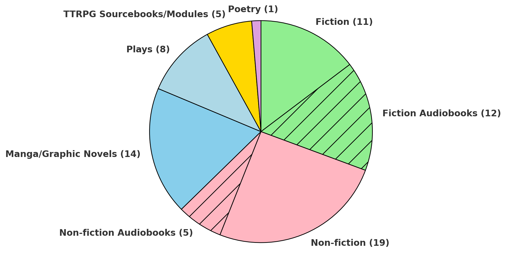

# Best Books of 2024

I read 75 books in 2024, by far my most ever, so I thought I'd do a quick roundup of my top 5 fiction and non-fiction.

In no particular order:

### Fiction
***Great Expectations* (1861) by Charles Dickens**
*"Her contempt for me was so strong, that it became infectious, and I caught it."*
My first proper Dickens. Funny and tragic, great characters, witty, richly thematic, idealistic but grounded. 

***It* (1986) by Stephen King**
While King's prose is sometimes excrutiatingly waffling, it does have a certain conversational, folksy charm which suits the audiobook format especially well. The story is truly epic in its scope and themes: childhood, memory, fear, friendship, etc etc. Laid out the blueprint for the now-classic supernatural coming-of-age tale.

***Watership Down* (1972) by Richard Adams**
*"All the world will be your enemy... be cunning and full of tricks and your people shall never be destroyed."*
I expected *Wind in the Willows*; I got *Lord of the Rings* with rabbits. Adams crafts a convincing lapine language and mythology around El-ahrairah, the 'Prince with a Thousand Enemies' which nicely complements the epic saga of a band of outcast rabbits searching for, establishing, and defending a new home. 

***Shadowdark RPG* (2023) by Kelsey Dionne**
Tenuously a 'non-fiction' book, but I have to give credit to this masterclass in RPG writing: simple but clever rules that utilise common sense and leave ample room for flexibility; a succinct but thematic writing style that respects the GM/player's time; heavily stylised, old-school art and formatting. You could run great TTRPGs sessions for decades using only this book as a resource and never run out of inspiration. The best of modern D&D and old-school renaissance together in one beautifully made A5 book.

***Wuthering Heights* (1847) by Emily Bronte**
*"I have no pity! I have no pity! The more the worms writhe, the more I yearn to crush out their entrails!"*
One of the best books I've ever read. So evocative and cinematic. I keep thinking of the word *pagan*, from this review in the preface:
| “Too odiously and abominably pagan to be palatable even to the most vitiated class of English readers”
I cannot imagine a more compelling endorsement for a book.

### Non-fiction

***Essays* (1941)/ *Down and Out in Paris and London* (1933) by George Orwell**
*"His body might be in the spike, but his spirit soared far away, in the pure aether of the middle classes."*
*"It is a strange fact, but it is unquestionably true that almost any English intellectual would feel more ashamed of standing to attention during ‘God save the King’ than of stealing from a poor box."*
A bit of a cheat, but *Down and Out* is basically two extended essays and (and parts of it became separate essays). An authoritative voice on almost any topic; I'm especially impressed by his ability to write intelligently (but, crucially, not *intellectually*) about socialism, and why it needn't necessarily be at odds with patriotism. D&O is wonderfully grimy and basically a proto-*Kitchen Confidential*.

***Budapest* by Victor Sebestyen (2022)**
Read before/while visiting earlier this year. Casts the story of the city as the development of the Hungarian national character: a relatable antihero, perennial underdog and occasional badly-behaved overdog. Tight, almost to the point of being insufficiently detailed. Loads of nice little asides about the city itself which made the trip that much richer. The last few chapters, from the Red Army siege through occupation, revolution and up to the fall of the USSR was enthralling enough to make me forget that I forgot I was absolutely knackered and stuffed into a delayed Ryanair flight at midnight.

***A Promised Land* (2020) by Barack Obama**
Barack Obama's first volume of presidential memoir is as thoughtful and readable as his first memoir, *Dreams from my Father* (1995). I'm torn about about his neoliberalism, but grateful that we got Obama as leader of the free world; he is probably the closest thing to *The West Wing*'s Jed Bartlett that we will ever get. He writes intelligently here about compromise, the difficulties of political gridlock, and trying to act with principle in the face of amoral detractors.

***Gweilo* (2004) by Martin Booth**
A memoir of a British child growing up in post-war Hong Kong, it is a sweet love letter to the city, to Chinese culture, and to Booth's mother, whom he clearly credits for instilling in him a sense of wonder and adventure and open-mindedness that is the thesis of the book. 7-10-year-old Booth rambles around HK streets eating beetles and century eggs, chatting with prostitutes, hotel porters, street vendors and, at one point, a triad mafioso who gives him a view of the Walled City's interior from an opium den. It beggars belief a little and is utterly charming. Booth's father, and his fading relationship with his wife and son as they grow towards HK and each other and away from him, is a welcome source of pathos and narrative cohesion that prevents the book from being simply a series of remembrances.

***The Power Broker* (1974) by Robert Caro**
*"Once the avenue had been a place for people; Robert Moses had made it a place for cars. ... The vicious gyre of urban decay began."*
*"To compare the works of Robert Moses to the works of man, one has to compare them not to the works of individual men but to the combined total work of an era. ... In sheer physical impact on New York and the entire New York metropolitan region, he is comparable not to the works of any man or group of men or even generations of men. In the shaping of New York, Robert Moses was comparable only to some elemental force of nature."*

The Power Broker is my new favourite book. Robert Caro's 1200-page masterpiece is more than a biography; it is a holy text of urbanism, politics and power.

Robert Moses begins as an idealistic yet arrogant polisci PhD, cleverly plotting the misappropriation of funds for his Yale swim team and threatening to resign if his plan is not carried out. At his apex, he is the most powerful man in New York, regularly facing down the mayor and governor in battles of will (or otherwise puppeteering them), threatening to resign if he does not get his way — and getting his way every time.

His rise to power — on the wings of public acclaim, after fighting to wrest verdant Long Island land from robber barons for the good of leisure-and-air-starved New Yorkers — followed by its misuse — ripping through communities with ugly, ineffectual expressways, obliterating slums and creating new, even worse ones, destroying thousands of lives, including his own brother's, for little reason but ego — is the ultimate real-life supervillain arc.

As a story, TBP is as epic and tragic a narrative as any novel I can imagine. Caro is not only a researcher of staggering skill and tenacity but a master storyteller. The human story, of a good (or at least idealistic) man turned bad (or at least dangerously egotistic and callous), is as compelling as the political story, of how power really, truly, works, how compromises are reached and forced, things are built, injustices propagated, complex systems mastered and exploited.

I'm not sure I'll ever be able to look at a bridge or road or public park again without thinking of Robert Moses and Robert Caro. The Power Broker has rewired my brain. To quote Mike Schur from the 99% Invisible podcast's [excellent breakdown series on TPB](https://99percentinvisible.org/club/), reading this book feels like being inducted into the Masons. Shake my hand; begin this book. Wait for the tickle.

